# Welcome to project Assets

## Overview

This is an initiative to visualize NuGet package dependencies in a given project. The side effect of this project is a library of ProjectAssets.Core.

## Get started

* Clone the repo

* Go to CLI folder

```shell
cd src/ProjectAssets.CLI
```

* Run

```shell
dotnet run -- -i obj
```

This generates the package reference mermaid chart at `data/output.mmd`.

* Visual

Copy & paste the text in `data/output.mmd` to any mermaid visualizer. For example: <https://mermaid.live>
  * If the mermaid file becomes too big to render, use the configuration tab to increase the default settings:
    .

## Trim down to specific package

Chances are, that not all packages are interested. You can specify a target package for analysis. For example:

```shell
dotnet run -- -i obj -t "Microsoft.Extensions.Configuration"
```

You will get:

```mermaid
stateDiagram-v2
net6.0 --> 📦Microsoft.Extensions.Configuration.Json/6.0.0
📦Microsoft.Extensions.Configuration.Json/6.0.0 --> 📦Microsoft.Extensions.Configuration.FileExtensions/6.0.0
📦Microsoft.Extensions.Configuration.FileExtensions/6.0.0 --> 📦Microsoft.Extensions.Configuration/6.0.0
📦Microsoft.Extensions.Configuration.Json/6.0.0 --> 📦Microsoft.Extensions.Configuration/6.0.0
net6.0 --> 📦Microsoft.Extensions.Logging.Console/6.0.0
📦Microsoft.Extensions.Logging.Console/6.0.0 --> 📦Microsoft.Extensions.Logging.Configuration/6.0.0
📦Microsoft.Extensions.Logging.Configuration/6.0.0 --> 📦Microsoft.Extensions.Configuration/6.0.0
📦Microsoft.Extensions.Configuration/6.0.0 --> 📦Microsoft.Extensions.Configuration.Abstractions/6.0.0
📦Microsoft.Extensions.Configuration.Abstractions/6.0.0 --> 📦Microsoft.Extensions.Primitives/6.0.0
📦Microsoft.Extensions.Primitives/6.0.0 --> 📦System.Runtime.CompilerServices.Unsafe/6.0.0
📦System.Runtime.CompilerServices.Unsafe/6.0.0 --> [*]
📦Microsoft.Extensions.Configuration/6.0.0 --> 📦Microsoft.Extensions.Primitives/6.0.0
```



## Only upstream or downstream of a given package

```shell
dotnet run -- -i obj -t "Microsoft.Extensions.Configuration" -d Up
```

And get:

```mermaid
stateDiagram-v2
net6.0 --> 📦Microsoft.Extensions.Configuration.Json/6.0.0
📦Microsoft.Extensions.Configuration.Json/6.0.0 --> 📦Microsoft.Extensions.Configuration.FileExtensions/6.0.0
📦Microsoft.Extensions.Configuration.FileExtensions/6.0.0 --> 📦Microsoft.Extensions.Configuration/6.0.0
📦Microsoft.Extensions.Configuration.Json/6.0.0 --> 📦Microsoft.Extensions.Configuration/6.0.0
net6.0 --> 📦Microsoft.Extensions.Logging.Console/6.0.0
📦Microsoft.Extensions.Logging.Console/6.0.0 --> 📦Microsoft.Extensions.Logging.Configuration/6.0.0
📦Microsoft.Extensions.Logging.Configuration/6.0.0 --> 📦Microsoft.Extensions.Configuration/6.0.0
```



## Use the docker image CLI

Docker image CLI is supported. A quick use:

* Pull the image

```shell
docker pull saars/ast-cli
```

The container looks for input files in /data. So for example, if you have a `project.assets.json` defined on your system in `c:\src\project\obj`, you can use the container to generate a Mermaid(mmd) file as follows:

```shell
docker run -it -v c:\src\project\obj:/data saars/ast-cli
```
This will map `c:\src\project\obj` into `/data` in the container. And you will find the output file at:

```shell
c:\src\project\obj\output.mmd
```

## Credit

This project is inspired and helped by:

* [@JacobBovee](https://github.com/JacobBovee)
* [@sbosell](https://github.com/sbosell)